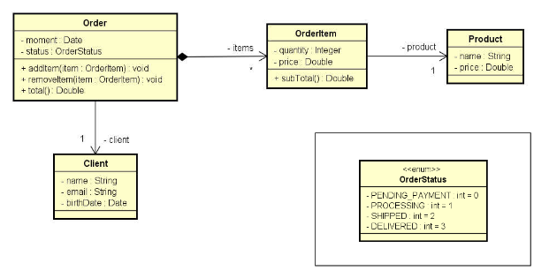

# Sistema de cadastro e consulta de produtos
Sistema de cadastro de clientes, produtos, itens e ordem, abordando referência e associação de classes.
Exercício proposto na aula sobre Composição do canal <https://devsuperior.com.br>.

## 📦 Desenvolvimento
Enunciado do exercício: Ler os dados de um pedido com N itens (N fornecido pelo usuário). Depois, mostrar um
sumário do pedido conforme exemplo (próxima página). Nota: o instante do pedido deve ser o instante do sistema: new Date().

## 🛠️ Construído com
Java 11

